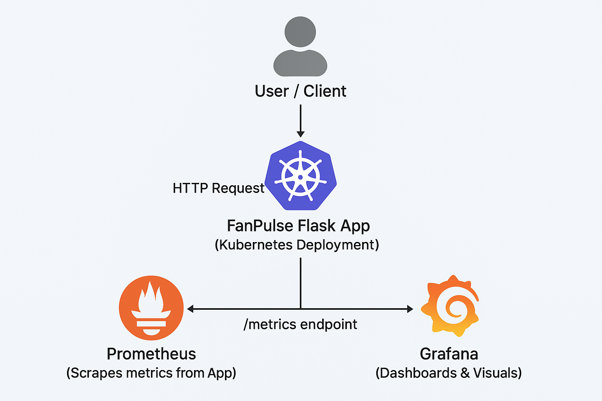

# FanPulse – Real-time Game Score Service

A simple sports score API deployed on Kubernetes with Helm, monitored via Prometheus + Grafana.

## Features
- Python Flask app simulating real-time scores
- Dockerized for portability
- Kubernetes deployment with Helm
- GitHub Actions CI/CD pipeline
- Observability with Prometheus, Grafana, Loki
- Horizontal scaling with HPA
- Error simulation & monitoring for alerting demos

## Architecture

## Quick Start Guide

1. Start Minikube:

    minikube start

2. Build & Deploy Locally:

    docker build -t fanpulse:latest ./app
    helm upgrade --install fanpulse ./charts/fanpulse

3. Install Promethus and Grafana

    helm repo add prometheus-community https://prometheus-community.github.io/helm-charts
    helm repo add grafana https://grafana.github.io/helm-charts
    helm repo update
    helm upgrade --install prometheus prometheus-community/prometheus
    helm upgrade --install grafana grafana/grafana

4. Port-forward Services:

    kubectl port-forward svc/fanpulse 5000:5000
    kubectl port-forward svc/prometheus-server 9091:80
    kubectl port-forward svc/grafana 3000:80

    Now access in browser:
    - Flask App → http://localhost:5000
    - Prometheus → http://localhost:9090
    - Grafana → http://localhost:3000
    
5. Get Grafana Admin Password
    
    kubectl get secret grafana -o jsonpath="{.data.admin-password}" | base64 --decode ; echo

6. Add Prometheus as Data Source in Grafana
	- Go to Grafana → Settings → Data Sources → Add Data Source.
	- Choose Prometheus.
	- Set URL = http://prometheus-server.monitoring.svc.cluster.local:80
	- Save & Test.

7. Import Your Dashboard
	- In Grafana, go to Dashboards → Import.
	- Upload your modified fanpulse-monitoring.json.
	- Start seeing metrics (app_requests_total, app_errors_total, etc).
